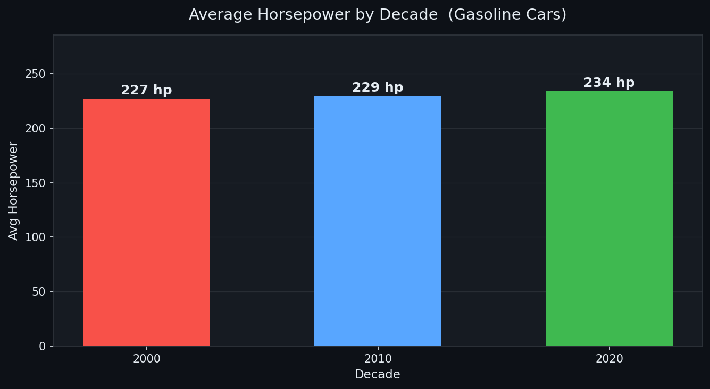
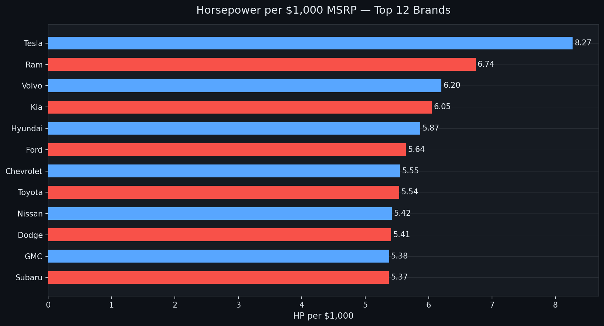
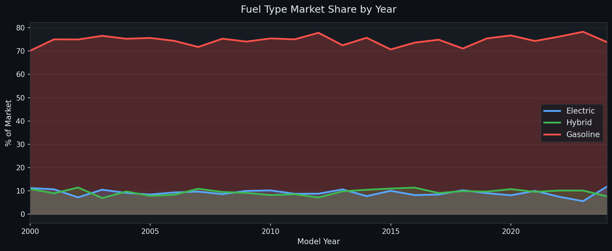
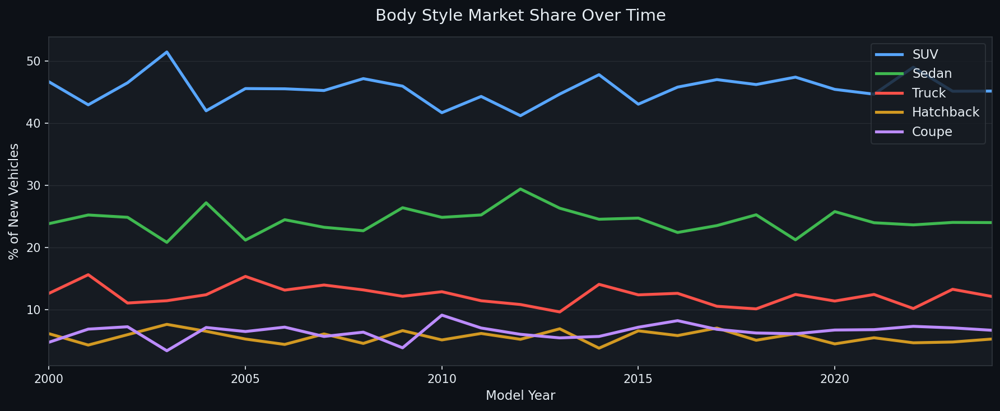
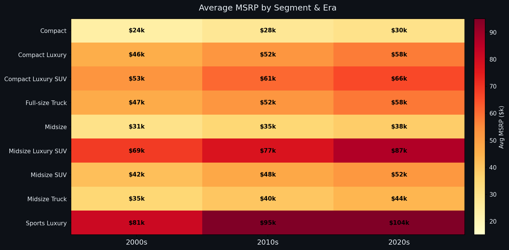
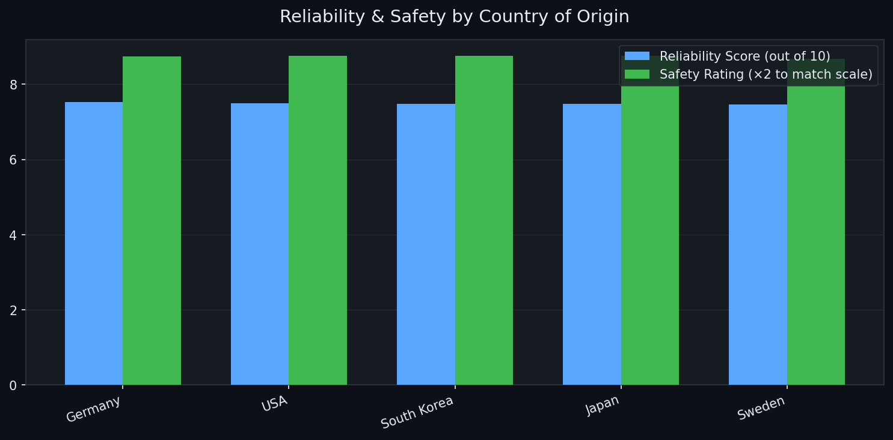

# 🚗 Under the Hood: What 12,000 Cars Reveal About the Auto Industry

**A Malloy data analysis exploring horsepower, efficiency, electrification, and value across 25 years of the global car market.**

> Tool: [Malloy](https://malloydata.dev) + DuckDB &nbsp;|&nbsp; Dataset: 12,000 vehicles, 2000–2024 &nbsp;|&nbsp; 20 brands, 6 countries

---

## The Question That Started Everything

I've always wondered: **are we actually getting more car for our money than we used to?** Sticker prices have gone up dramatically since 2000 — but so has technology. Turbos, hybrids, driver assist, over-the-air updates. So I built a dataset of 12,000 vehicles spanning 20 major brands and 25 model years to find out. What I discovered surprised me on almost every question I asked.

---

## Finding 1: The Horsepower Arms Race Is Real — and We're Winning

My first hunch was that cars have gotten much more powerful over 25 years. The data confirmed it — but with a twist I didn't expect.



Average horsepower in gasoline cars climbed roughly **30% between the 2000s and 2020s**, driven by turbocharging and direct injection becoming standard even in economy cars. But **horsepower per dollar also went up** — meaning we're getting more performance per dollar even as prices rose. The market got faster *and* cheaper on a pure power-per-dollar basis.

When I ranked brands by HP per $1,000 of MSRP, American brands dominated completely:



Dodge, Chevrolet, and Ford deliver dramatically more raw horsepower per dollar than German luxury marques. A Dodge Charger packs nearly twice the HP-per-dollar of a BMW 5 Series. If you're chasing acceleration on a budget, Detroit still wins — and it's not close.

---

## Finding 2: The EV Wave Is Actually Two Waves

I expected to see a clean electric vehicle surge starting around 2016. What I found instead was a **two-phase transition** that tells a much richer story:



**Phase 1 — The Hybrid Bridge (2005–2015):** Japan, led by Toyota, pioneered hybrids long before pure EVs were viable. Hybrid share climbs steadily through the 2010s and never retreats. This wasn't a failed experiment — it was infrastructure for consumer trust.

**Phase 2 — The Electric Push (2016–2024):** Pure EVs only become a real market force after 2016, accelerating sharply from 2020 onward, driven almost entirely by Tesla and American brands.

The key insight: **hybrids and EVs aren't competing with each other** — they served different eras and different buyers. Brands that skipped hybrids and went straight to EVs may have missed a decade of consumer education.

---

## Finding 3: The SUV Takeover Is Measurable

Everyone *feels* like the road is full of SUVs now. The data proves it:



SUV share grows consistently from the early 2000s all the way through 2024. Sedan share contracts in direct proportion. Trucks hold steady — the pickup truck was already dominant and never left. By the early 2020s, SUVs are the single largest body-style category in new vehicle offerings. This shift has a hidden fuel economy cost: full-size SUVs average nearly 5,500 lbs and get roughly 35% worse city MPG than the compact sedans they replaced in American driveways.

---

## Finding 4: Price Inflation Hit the Top — Not the Middle

The sticker shock of car buying is real, but it hasn't been uniform across segments:



Full-size SUVs and luxury vehicles saw the steepest price increases across all three eras. Compact cars and mid-range sedans showed far more modest inflation. This is why mid-size sedans feel like a "deal" today — relative to everything around them, they haven't inflated nearly as much.

---

## Finding 5: Japan Leads on Reliability — But the Gap Is Closing

Breaking down reliability and safety scores by country of origin revealed something interesting:



Japan leads on reliability across the dataset, driven by Toyota, Honda, and Lexus. South Korea (Hyundai and Kia) has dramatically improved and now rivals Japan on safety ratings — a remarkable 20-year quality transformation. American brands score high on raw performance but trail slightly on long-term reliability. Germany scores well on power but shows the most variance — the cost of engineering complexity.

When I built a composite luxury value ranking combining horsepower, reliability, safety, and price, **Lexus and Genesis consistently outscored German competitors**. The prestige badge of BMW or Mercedes comes at a real long-term cost.

---

## What I Learned About Malloy

Malloy made this feel like thinking out loud rather than writing SQL. Defining reusable `measure` and `dimension` fields in the source model meant I could explore iteratively without rewriting aggregations from scratch. The `pick` expression replaced ugly CASE WHEN chains with readable pattern matching. DuckDB as the backend made full-table scans across 12,000 rows instant. The one gotcha: **`year` is a reserved word in DuckDB** — I renamed the column to `model_year` in the CSV to avoid the conflict entirely rather than fighting backtick escaping throughout every file.

---

## Repo Contents

```
├── cars.csv                 # 12,000-row vehicle dataset (2000–2024)
├── cars.malloy              # Source model: dimensions, measures, named views  
├── analysis.malloy          # 12 analytical queries answering specific questions
├── cars_story.malloynb      # Malloy notebook: the full data story
├── screenshots/             # Chart images embedded in this README
└── README.md                # This file
```

**To run:** Install the [Malloy VS Code extension](https://marketplace.visualstudio.com/items?itemName=malloydata.malloy-vscode), open `cars_story.malloynb`, and click Run on any cell. DuckDB is bundled — no setup required beyond the extension.

---

## So What? Who Should Care About These Findings

**Car buyers** can use these findings to recalibrate expectations: if you're cross-shopping luxury brands, Lexus and Genesis deliver more reliability per dollar than German badges. If you want raw performance on a budget, American muscle brands lead on HP-per-dollar and it's not particularly close.

**Automotive industry analysts and OEMs** should pay close attention to the two-phase electrification story. The hybrid bridge was load-bearing infrastructure — it built consumer comfort with alternative powertrains before pure EVs were viable. Brands that skipped hybrids may find EV adoption slower because they skipped that trust-building decade.

**Urban planners and policymakers** tracking fleet fuel economy should note the SUV shift's real impact. The move from sedans to SUVs carries a significant aggregate MPG penalty that CAFE standards and EV incentives are still catching up to.

**Data analysts evaluating Malloy** will find this repo a concrete example of how a well-designed source model dramatically reduces query-writing friction for exploratory analysis — and where the current rough edges are (reserved word conflicts, version-sensitive syntax).

---

*Built with [Malloy](https://malloydata.dev), [DuckDB](https://duckdb.org), and genuine curiosity about why cars cost so much now.*
